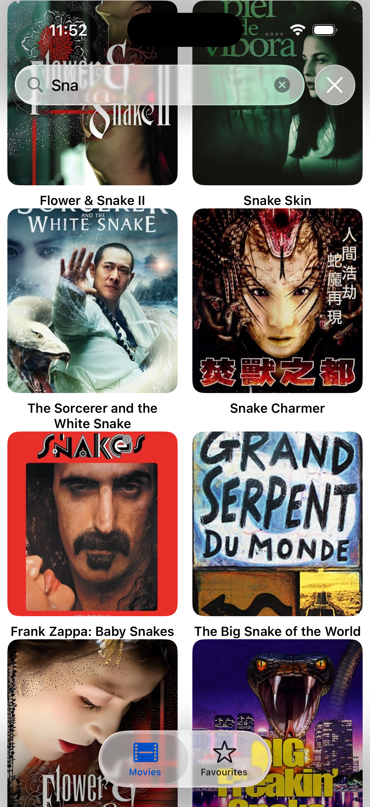
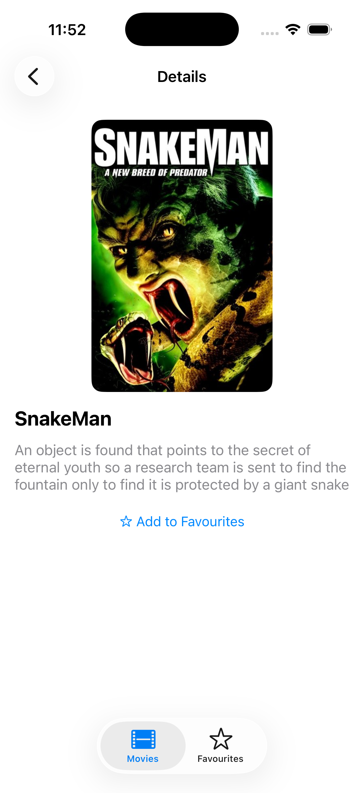
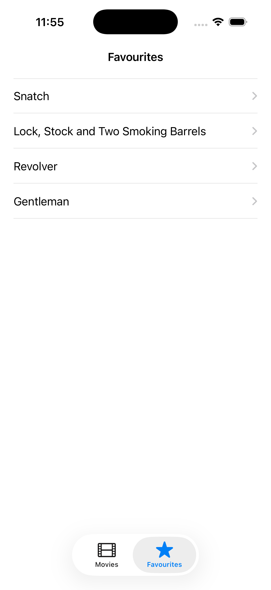

# Movies App 🎬

iOS application for searching movies and managing favourites.

The app allows users to search movies using the TMDB API, view movie details, and save favourite movies locally.

---

## Features

- 🔍 Movie search with debounced input
- 🎞 Movie details screen (poster, title, overview)
- ⭐ Add / remove movies to Favourites
- 💾 Persistent storage using CoreData
- 🧭 Tab-based navigation
- 📱 UIKit-based UI (no Storyboards)

---

## Tech Stack

- **UIKit**
- **URLSession**
- **CoreData**
- **Auto Layout**
- **Git / GitHub**

---

## Screenshots

  
  
  
  

---

## Architecture

- Feature-based project structure
- Separation of UI, networking, and persistence layers
- No third-party libraries

---

## Requirements

- iOS 15+
- Xcode 15+

---

## Author

Kirill Gawin
